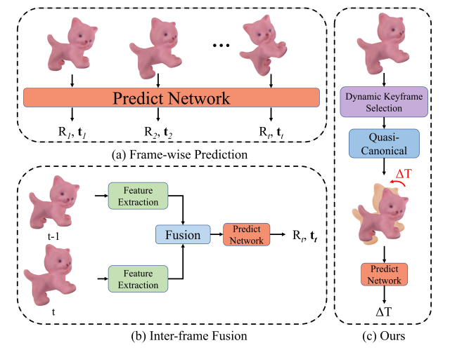

<h1 align="center">
PPF_Tracker: Exploring Category-level Articulated Object Pose Tracking on
SE(3) Manifolds
</h1>

<p align='center'>
 </img>
</p>

<div align="center">

</div>
 
  Articulated objects are prevalent in daily life and robotic manipulation tasks. However, compared to rigid objects, pose tracking for
  articulated objects remains an underexplored problem due to their
  inherent kinematic constraints. To address these challenges, this
  work proposes a novel point-pair-based pose tracking framework,
  termed PPF-Tracker.


# Overview

This is the official code implementation of PPF_Tracker.
  
# Installation
[Pyrender install Instruction](https://pyrender.readthedocs.io/en/latest/install/index.html)
<details>
<summary><b>Create Conda Env</b></summary>

```
conda create -n ppf_tracker python=3.8
conda activate ppf_tracker
```
</details>

<details>
<summary><b>Install Pytorch</b></summary>

```
conda install pytorch torchvision cudatoolkit=10.2 -c pytorch-lts
```
</details>


<details>
<summary><b>Install Other Dependencies</b></summary>

```
pip install tqdm opencv-python scipy matplotlib open3d==0.12.0 hydra-core pyrender cupy-cuda102 PyOpenGL-accelerate OpenEXR
CXX=g++-7 CC=gcc-7 pip install MinkowskiEngine==0.5.4 -v  
```
</details>

<details>
<summary><b>Miscellaneous</b></summary>
Notice that we use pyrender with OSMesa support, you may need to install OSMesa after running ```pip install pyrender```.

``MinkowskiEngine`` append its package path into ``sys.path`` (a.k.a., PYTHONPATH), which includes a module named ``utils``. In order not to get messed with our own ``utils`` package, you should import ``MinkowskiEngine`` after importing ``utils``.
</details>

# Dataset
Our dataset can be availabel at [here](https://pan.baidu.com/s/1taaHuE4yo_mEcd38yrGLHQ?pwd=3560). You can download it ant put it into your_dataset_path. 

# Training and testing
Beforing training, you need to modify the config.yaml to your own path. Then you can run own code easily.
```
CUDA_VISIBLE_DEVICES=0,1,2,3 python train_ppf_multi_proc.py
```
Then, you can begin tracking by
```
CUDA_VISIBLE_DEVICES=0 python tracking.py --ckpt_path yourpath --angle_prec 1.5 --num_rots 72 --n_threads 512
```